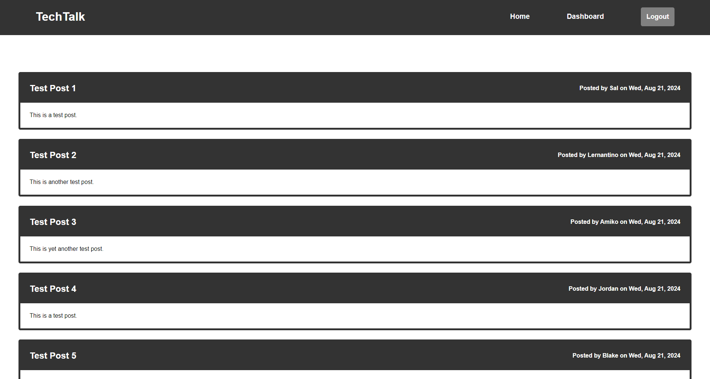

# TechTalk

## Table of Contents
- [Description](#description)
- [Installation](#installation)
- [Node Packages](#node-packages)
- [License](#license)

## Description
TechTalk is a full-featured blogging platform built using the Node.js Model-View-Controller (MVC) architecture. This application allows users to create an account, authenticate themselves, and perform various blogging activities. Authenticated users can upload new posts, edit their existing posts, and delete posts they no longer want. Additionally, users can comment on posts uploaded by other users, fostering a community of interaction and discussion. The application leverages Sequelize, a promise-based Node.js ORM, to interact with the back-end database, ensuring efficient and secure CRUD (Create, Read, Update, Delete) operations. The front-end user interface is designed to be intuitive and user-friendly, making it easy for users to navigate and perform actions.

[](https://techtalk-n53q.onrender.com)

## Installation

```bash
# Navigate to your desired directory
cd path/to/your/desired/directory
# Clone the repository
git clone https://github.com/mikematics22800/TechTalk
# Enter the project directory
cd TechTalk
# Install dependencies
npm i
# Run local server
node index
```

## Node Packages
bcrypt | connect-session-sequelize | dotenv | express | express-handlebars | express-session | pg | sequelize


## License
[](https://opensource.org/licenses/ISC)
